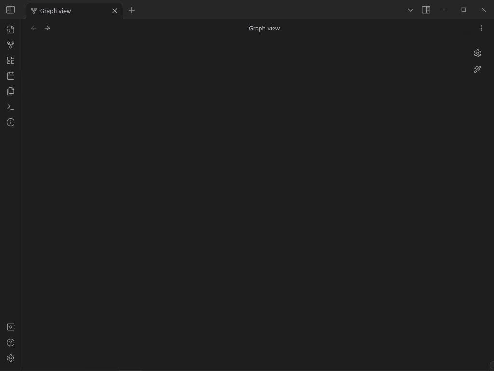

# Wiki2note for Obsidian

## Introduction

Wiki2note is an Obsidian plugin born from personal challenges I faced in managing and organizing information effectively on Obsidian. It aims to simplify the process of creating a coherent and accessible knowledge vault by leveraging the structured repository of Wikipedia as a single source of truth.

## How Wiki2note Works

Wiki2note simplifies knowledge management by addressing common issues such as note duplication and the challenge of identifying relevant keywords. By integrating directly with Wikipedia, it provides a consistent source of truth for note titles. 

Here’s how it enhances your workflow:

- **Seamless Wikipedia Integration:** The plugin uses Wikipedia's API to fetch and integrate articles into your Obsidian vault, reducing the friction during the keyword concept hunting process.
- **Automated Note Creation:** If a concept doesn't exist in your vault, Wiki2note automatically creates a new note with the standardized title from the selected EN Wikipedia entry. This ensures consistency and prevent note fragmentation.
- **Encourages Discovery and Learning:** By adding a summary and a direct link to the original Wikipedia article to the generated note, the plugin invites exploration and serendipitous learning.

## Advanced Search and Multilingual Support with OpenAI GPT-3

Another features of the plugin is its integration with OpenAI's GPT-3, which comes into play when initial searches return no matches. This simple fallback mechanism enhances the plugin’s search functionality by introducing a semantic component to the process, enabling more nuanced and contextually aware queries.

- **Semantic Search Enhancement:** When a query yields no results, Wiki2note leverages GPT-3 to reinterpret the search terms, considering their semantic meaning and context. This approach often leads to the discovery of relevant articles that might have been missed due to the rigidity of Wikipedia's keyword-based search.
  
- **Facilitating Serendipitous Discovery:** This semantic search capability opens up avenues for serendipitous learning, guiding users to articles and concepts they might not have directly searched for.

- **Multilingual Query Support:** Another significant advantage of integrating GPT-3 is its ability to bridge the language divide. Users can input queries in one language, and the plugin will still find the corresponding English Wikipedia article, ensuring all information remains anchored to a single, consistent source of truth. 

## Demo

## Getting Started

1. **Manual Installation:** From the release, download `main.js`, `styles.css`, and `manifest.json` and place them in your `VaultFolder/.obsidian/plugins/wiki2note/`.
2. **Open AI Key:** to use the gpt-3 enabled fallback search feature you need to set a valid openai API key as an environment variable called `OPENAI_API_KEY`.
3. **Usage:** Activate the plugin in Obsidian and optionally set a custom keybind.

## Developpers

This plugin is built from the official sample plugin realeased by the obsidian team. For detailed instruction on how to compile the plugin yourself and make modifications, please refer to the [README](https://github.com/obsidianmd/obsidian-sample-plugin) of the official sample plugin.

TLDR :
1. `git clone https://github.com/Endlessflow/wiki2note.git` inside your plugin folder
2. `npm i`
3. `npm run dev` (this compiles and listens to changes in your main.ts)
4. make changes
5. reload obsidian to see changes

## License

Wiki2note is open-source, available under the MIT license. You’re encouraged to explore the code, contribute, or customize it to suit your workflow.
